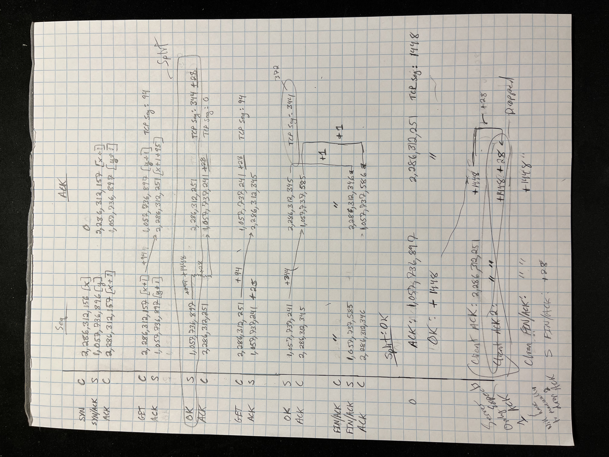

# CS 461 Computer Security I | ECE 422 Computer Security I

## Introduction

Hey there! :wave:

> I put this repository together for the CS461: Computer Security I (ECE 422) final exam. It's mainly focused on machine problems, application security (AppSec), web security (WebSec), threat modeling (ThreatSec), cryptography (Crypto), and network security (NetSec).
>
> Think of it as a launchpad for your own learning adventure, not a cheat sheet. The best part about studying is figuring things out yourself, not taking shortcuts.
>
> But hey, we all get stuck sometimes!  If peeking at some potential solutions helps you on your way, feel free to explore. 
>
> **PLEASE DO NOT COPY ANSWERS**

If you find this repository useful, let's connect on :link: [LinkedIn](https://linkedin.com/in/alex-badia)!


# Network Security (NetSec)

> “The Internet was never designed to be secure.” – Dan Kaminsky

### Objectives

After completing this MP, you will understand:
 - How ARP binds IP addresses to link-layer addresses and how IP hijacking works.
 - How DNS works and how to carry out a man-in-the-middle attack on DNS traffic.
 - How TCP connections work and how to carry out a man-in-the-middle attack on TCP traffic.
 - How an off-path TCP session spoofing attack works against a host with a predictable TCP
sequence number generator.

## Checkpoint 1

### 5.1.1 Exploring Network Traffic

As the student user in the VM, use Wireshark to observe traffic on the switch for at least 30 seconds. Recall that the switch interface shows you all traffic passing through the switch of your virtual
network.


> 1\. Identify all the active hosts on the local network, 10.4.22.0/24.
>    - What are their IP addresses?
>    - What are their MAC addresses?

Examine all the packets (skipping over src ip's you've already looked at)

_**Hint**_: Look at the Ethernet layer for MAC addresses and the IP layer for IP addresses

> 2\. What is the IP address of the gateway?

Remember, devices on a network typically get IP addresses assigned 1 of 2 ways:
  1. Statically
  2. Dynamically (via a DHCP server)

_**Hint**_: It is common convention, for network administrators to configure the default gateway with the **first usable IP address** in the subnet.

_**Fun Fact**_: Did you know, in home networks, typically the router acts as a gateway and DHCP server?

> 3\. One of the hosts performed port scanning, a technique used to find network hosts that have
services listening on targeted ports. 
>
> - What is the IP address of the port scanner?

_**Hint**_: Look for an IP address that is attempting to connect to multiple ports of the same host (regardless of the type of protocol).

> 4\. The client performed DNS lookup, a technique used to retrieve information associated with
domain names.
>
> - What is the fully-qualified domain name (FQDN) of the DNS query? 
>
> - What IP address does
the name resolve to?

_**Hint**_: Type "dns" into the filter bar 

> 5\. The client performed an HTTP request, a technique commonly used for retrieving HTML
documents from Internet hosts.
> 
> - What URL is the client retrieving from the Web server?

_**Hint**_: Type "http" into the filter bar 

### 5.1.2 Interacting with Network Hosts

For this problem, you will log into client by running: `ssh root@<client-ip-from-part-1>` with the password _securepassword_. From the client, you will perform a basic DNS query and HTTP request. These commands will be helpful for Checkpoint 5.2.1 to verify the success of your attacks.

> 1\. Use dig to query the DNS server you found in 5.1.1. 
>
> What does smtp.bankofbailey.com resolve to? 

_**Hint**_: Check the `;; ANSWER SECTION:`

```
root@client:~# dig smtp.bankofbailey.com

; <<>> DiG 9.11.3-1ubuntu1.11-Ubuntu <<>> smtp.bankofbailey.com
;; global options: +cmd
;; Got answer:
;; ->>HEADER<<- opcode: QUERY, status: NOERROR, id: 6495
;; flags: qr aa rd ra; QUERY: 1, ANSWER: 1, AUTHORITY: 1, ADDITIONAL: 2

;; OPT PSEUDOSECTION:
; EDNS: version: 0, flags:; udp: 4096
; COOKIE: 3975471f648071fba2d241ac661ef87e4a019959c121ad52 (good)
;; QUESTION SECTION:
;smtp.bankofbailey.com.         IN      A

;; ANSWER SECTION:
smtp.bankofbailey.com.  604800  IN      A       10.4.22.169

;; AUTHORITY SECTION:
bankofbailey.com.       604800  IN      NS      ns.bankofbailey.com.

;; ADDITIONAL SECTION:
ns.bankofbailey.com.    604800  IN      A       10.4.22.80

;; Query time: 1 msec
;; SERVER: 10.4.22.80#53(10.4.22.80)
;; WHEN: Tue Apr 16 22:15:26 UTC 2024
;; MSG SIZE  rcvd: 127

root@client:~# 
```

<br>

> 2\. Use curl to retrieve http://www.bankofbailey.com from the Web server you found in 5.1.1. Make sure you submit the entire unmodified HTTP response, not just the HTML
portion.

_**Hint**_: To get the HTTP Headers, use the "include" flag in the curl command: `-i`

```
root@client:~# curl http://www.bankofbailey.com -i
HTTP/1.1 200 OK
Server: nginx/1.17.8
Date: Tue, 16 Apr 2024 22:19:06 GMT
Content-Type: text/html
Content-Length: 45
Last-Modified: Tue, 11 Feb 2020 18:07:23 GMT
Connection: keep-alive
ETag: "5e42ed5b-2d"
Cache-Control: no-cache
Set-Cookie: session=35YATR8R8SW8PCIA
Accept-Ranges: bytes

<html><body><h1>It works!</h1></body></html>
root@client:~# 
```

### 5.1.3 Scanning Network Hosts

For this problem, you will log into attacker by running: `ssh root@attacker` with the password _securepassword_. If you have forgotten the attacker IP address, you can run `sudo netsec-info`. From attacker, you will first use Nmap to identify open ports on the local network. You will then use Scapy to write your own Python program to scan individual IPs and report which ports are open.

> 1\. Use Nmap (only available on attacker) to determine which hosts on the local network, 10.4.22.0/24, have an open TCP port between 1–1024 (inclusive), as determined by SYN scan.

_**Hint**_: run `nmap -p 1-1024 -sS 10.4.22.0/24`

Here's what each part of the command does:

1. `nmap`: This is the command to run Nmap, a powerful tool for network scanning.
2. `-p 1-1024`: This option tells Nmap to scan TCP ports in the range 1-1024.
3. `-sS`: This option tells Nmap to perform a SYN scan, which is a type of TCP scan that is less likely to be logged by the target system.
4. `10.4.22.0/24`: This is the IP address range of the local network you want to scan. The /24 at the end is CIDR notation for a subnet mask of 255.255.255.0, which means the scan will cover all IP addresses from 10.4.22.1 to 10.4.22.254.

> 2\. Write a SYN scanner using Scapy. You will turn in your program, rather than the results of the scan. Your solution will be graded by running it on a slightly different network. You can test your solution by scanning some of the hosts identified in earlier parts of Checkpoint 1. 
>
> _Note_: due to Scapy quirks, your scanner does not need to be able to scan the attacker host itself.

The main challenge is how to send messages with scapy, some things to note:
  - layers are stacked using an overloaded divisor operator
  - `send` will add an Ether layer to your packet, so make sure your packet doesn't already have an Ether layer defined. If your packet has an Ether layer use `sendp`.
  - flags can be defined using `int` or `str`

Lot's of this is trial and error, here's the core logic from my code:

```py
SYN  = 0b000010
RST  = 0b000100
ACK  = 0b010000
SYN_ACK = SYN | ACK
def scan_port(ip, port):
  sport = random.randint(0, 65535)
  resp = sr1(IP(dst=ip) / TCP(sport=sport, dport=port, flags=SYN), timeout=.250)
  if resp is not None:
    if resp.haslayer(TCP):
      if resp[TCP].flags.value == SYN_ACK:
        send(IP(dst=ip) / TCP(sport=sport, dport=port, flags=RST))
        return True
  return False
```

## Checkpoint 2

In this checkpoint, you will implement the following network attacks:

- ARP spoofing
- HTTP man-in-the-middle injection
- Off-path TCP session spoofing

These attacks MUST be carried out from attacker. You will have access to the switch in order to observe the normal interaction between hosts and to observe your attempted attacks. You will also have access to client to verify your attacks end-to-end. However, the autograder will run your program from attacker, and your program will not have access to other hosts

### 5.2.1.1  ARP Spoofing

> For this problem, you will implement an ARP spoofing attack that will allow you to impersonate webserver, dnsserver, and client on the network. You will use this attack to cause all traffic between these hosts to go through your host, attacker. You will need to pass the traffic through to the intended host, in order to observe the rest of the conversation.
>
> Once you have traffic flowing between the Web server, DNS server, and client correctly through your host (attacker), you will need to answer the following questions:
> - What host name is the client trying to resolve?
> - What is the IPv4 address corresponding to that name, returned by the DNS server in response to the query?
> - What is the value of the session cookie sent by the Web server to the client?
> - What is the value of the Basic Auth password sent to the Web server?

Conceptually, this is not difficult. The challenge lies in implementation. The best I can do is provide is a log from one of my runs, otherwise just look at my code:

```
root@attacker:~# python3 shared-with-host/abadia2/NetSec/cp2.1.passive.py -i eth0 --clientIP 10.4.22.9 --dnsIP 10.4.22.80 --httpIP 10.4.22.218 --verbosity 1
#       spoofing 10.4.22.9's ARP table: setting 10.4.22.80 to 02:42:ac:55:f4:3d
#       spoofing 10.4.22.218's ARP table: setting 10.4.22.9 to 02:42:ac:55:f4:3d
#       spoofing 10.4.22.9's ARP table: setting 10.4.22.218 to 02:42:ac:55:f4:3d
#       spoofing 10.4.22.80's ARP table: setting 10.4.22.9 to 02:42:ac:55:f4:3d
#       spoofing 10.4.22.9's ARP table: setting 10.4.22.80 to 02:42:ac:55:f4:3d
#       spoofing 10.4.22.218's ARP table: setting 10.4.22.9 to 02:42:ac:55:f4:3d
#       spoofing 10.4.22.9's ARP table: setting 10.4.22.218 to 02:42:ac:55:f4:3d
#       spoofing 10.4.22.80's ARP table: setting 10.4.22.9 to 02:42:ac:55:f4:3d
#       10.4.22.9, sent:Ether / IP / UDP / DNS Qry "b'www.bankofbailey.com.'" 
#       10.4.22.80, sent:Ether / IP / UDP / DNS Ans "10.4.22.218" 
*hostname:www.bankofbailey.com.
*hostaddr:10.4.22.218
#       10.4.22.9, sent:Ether / IP / TCP 10.4.22.9:37142 > 10.4.22.218:http S
#       10.4.22.218, sent:Ether / IP / TCP 10.4.22.218:http > 10.4.22.9:37142 SA
#       10.4.22.9, sent:Ether / IP / TCP 10.4.22.9:37142 > 10.4.22.218:http A
#       10.4.22.9, sent:Ether / IP / TCP 10.4.22.9:37142 > 10.4.22.218:http PA / Raw
*basicauth:hunter2
#       10.4.22.218, sent:Ether / IP / TCP 10.4.22.218:http > 10.4.22.9:37142 A
#       10.4.22.218, sent:Ether / IP / TCP 10.4.22.218:http > 10.4.22.9:37142 PA / Raw
*cookie:35YATR8R8SW8PCIA
#       10.4.22.9, sent:Ether / IP / TCP 10.4.22.9:37142 > 10.4.22.218:http A
#       10.4.22.9, sent:Ether / IP / TCP 10.4.22.9:37142 > 10.4.22.218:http FA
#       10.4.22.218, sent:Ether / IP / TCP 10.4.22.218:http > 10.4.22.9:37142 FA
#       10.4.22.9, sent:Ether / IP / TCP 10.4.22.9:37142 > 10.4.22.218:http A
^C#     restoring ARP table for 10.4.22.218
#       restoring ARP table for 10.4.22.80
#       restoring ARP table for 10.4.22.9
#       restoring ARP table for 10.4.22.9
root@attacker:~# ^C
root@attacker:~# ^C
root@attacker:~# 
```
### 5.2.1.2  Script Injection

> For this problem, you will use your man-in-the-middle capability to rewrite HTTP request responses sent from the Web server to the client to insert JavaScript into the HTML file served to the client. We have provided the following test HTML files and test cases for you to consider, and we recommend completing them in the order presented:
>
> - http://www.bankofbailey.com/index.html—basic single-packet HTTP response
> - http://www.bankofbailey.com/long.html—long multiple-packet HTTP response
> - curl <url> <same-url>—multiple HTTP request/response on a single TCP connection
> - http://www.bankofbailey.com/hard.html—script injection beyond packet boundary

Conceptually, this attack is simple. The challenge, once again, is implementation.

**Key Concept**: Understand how the sequence numbers and acknowledgements function when malicious HTML is injected into the server's response:

1. When you inject HTML, the client responds with sequence numbers and acknowledgements based on the altered packet.

2. The server remains unaware of the packet modification and still expects the original sequence numbers and acknowledgements.

3. To maintain a seamless connection, any traffic forwarded from the client to the server must have its sequence numbers and acknowledgements adjusted to reflect the expected values (as if no modification occurred). Traffic forwarded from the server to the client must be re-adjust to reflect the sequence numbers and acknowledgment numbers of the altered packet.
4. You must keep track of each TCP stream and/or HTTP stream, for multiple curls.

**Tips**:

1. Update the HTTP header of altered packets, including the `Content_Length` field
2. Delete the checksum fields in all layers to let scapy recalculate them for you

For the visually inclined, try drawing out the message sequence from Wireshark:



## 5.2.2 TCP Off-Path Session Spoofing

1. Study the RSH protool by running "root@attacker:~# rsh 10.4.61.25 uname" -ns 
    - Look at the cp2.2.mitnick/rsh.pcapng file in Wireshark for an example run

2. Send each packet from the attacker and study the Osiris' and Trusted Server's responses.
    - If you send too many packets too quickly, you may miss important responses such as Osiris or
    initiating new ACK's or SYN's based on packets you sent it. 

3. The IBM documentation for RSH has many ambiguities. I still can't figure out if sending an alternative stderr port is a *required* step. Empirically, the stderr port seems required. I also don't know if sending just a 0 (\x31) or a null byte (\x00) is valid.


Look at my code for further details.


## AppSec

TODO: Coming soon...

## WebSec

TODO: Coming soon...

## ThreatSec

TODO: Coming soon...

## Crypto

TODO: Coming soon...
